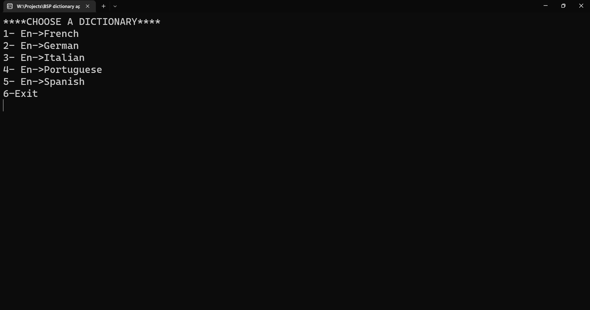
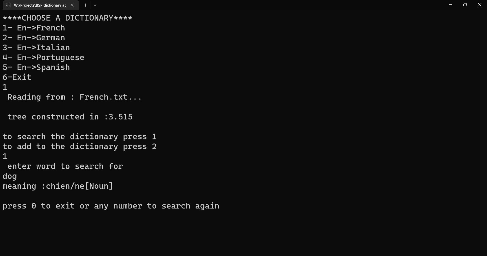
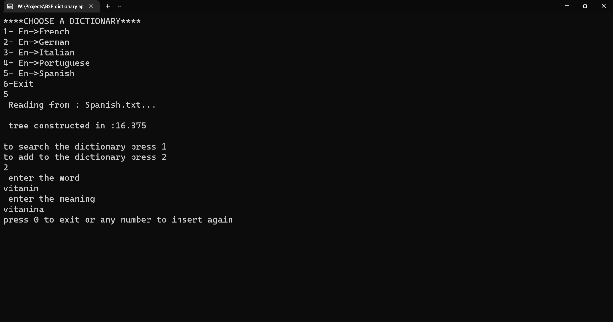

# BST-Dictionary-App
A dictionary app that translates from English to five different languages using a linked list binary search tree to search text files (a dictionary) containing the word and its meaning
# Screenshots
**Main menue**

**Translating From English To Frensh**

**Adding A New World To The Spanish Dectionary**

# TO RUN
run the sln(project solution) in visual studio.
